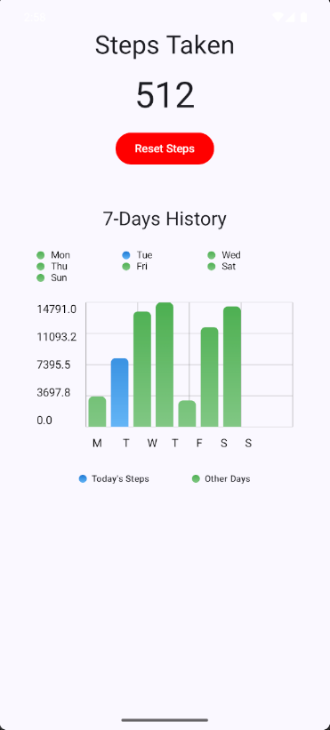

# Fitness Tracker App 🏃 ️

This is a special **Fitness Tracker App** created using **Kotlin, Jetpack Compose**.  
It's designed to track your steps and fitness goals 💖

---

## 🧠 Project Idea

> **Gym rats want to keep track of their fitness.**

The app features:

- Realtime Steps Counter ⏳
- 7-Days History Chart to have a weekly look 👀
- Smooth animations in Chart ✨

---

## Screenshots:

1. **Dashboard**
   
---

## 🛠️ Built With

- [Kotlin](https://kotlinlang.org/docs/android-overview.html)
- [Jetpack Compose](https://developer.android.com/compose)

---

## 🔧 Setup

To run / clone this project locally:

```bash
git clone https://github.com/hayatnabi/FitnessTrackerApp.git

```

Thanks for checking out this project! If you liked it, consider giving it a ⭐️ on GitHub